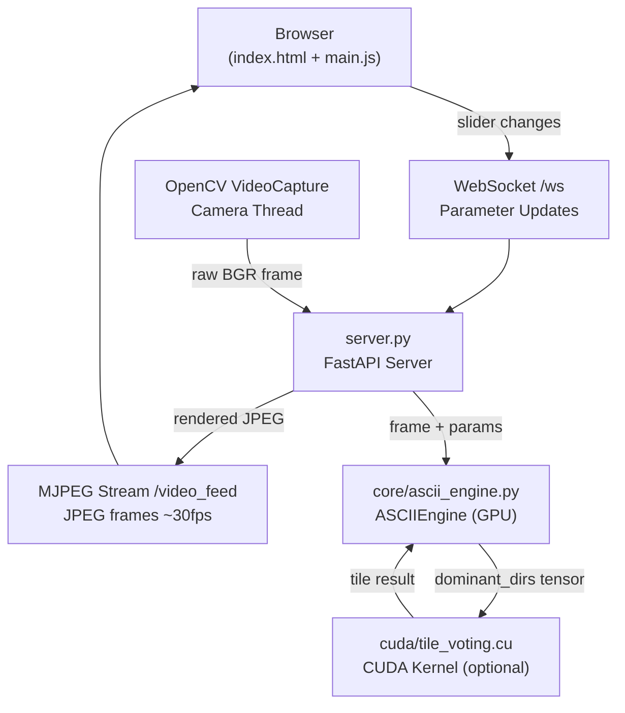

# 📖 Developer Reference — Live GPU ASCII Camera

A highly optimized, real-time ASCII art rendering system. Uses **PyTorch** for GPU acceleration, **OpenCV** for media I/O, a **custom C++/CUDA tile voting kernel** for hardware-accelerated pixel classification, and a **FastAPI + WebSocket** browser-based control interface.

---

## 📐 High-Level Architecture & Data Flow



### Per-Frame Rendering Pipeline

Each captured camera frame passes through these GPU stages inside `ASCIIEngine.process_frame()`:

```
Raw BGR Frame (NumPy)
  │
  ├─ [1] Zoom & Affine Warp       (OpenCV, CPU)
  ├─ [2] ToTensor + Normalize      (GPU)
  ├─ [3] Grayscale (ITU weighted)  (GPU)
  ├─ [4] Difference of Gaussians   (GPU — two gaussian blurs, thresholded diff)
  ├─ [5] Scharr Gradient (Gx, Gy)  (GPU — directional convolution)
  ├─ [6] Angle → Direction Class   (GPU — quantize θ into {0,1,2,3})
  ├─ [7] 8×8 Tile Voting           (CUDA kernel OR pure PyTorch fallback)
  ├─ [8] Luminance Downscale       (GPU — area interpolation to tile grid)
  ├─ [9] LUT Index Lookup          (GPU — map edge direction + lum to LUT column)
  ├─ [10] Color Palette Blend      (GPU — mix theme color with source color)
  └─ Output BGR Frame (NumPy, CPU)
```

```text
├── main.py                    # CLI entry point
├── server.py                  # FastAPI web server (MJPEG stream + WebSocket)
├── requirements.txt           # Python dependencies
├── readme.md                  # End-user readme
│
├── core/                      # Rendering engine Python package
│   ├── __init__.py
│   ├── ascii_engine.py        # ASCIIEngine class — full GPU rendering pipeline
│   ├── params.py              # ASCIIParams dataclass — shared config state
│   └── utils.py               # ensure_file_exists, print_progress_bar
│
├── cuda/                      # Custom C++/CUDA PyTorch extension
│   ├── tile_voting.cu         # CUDA kernel: parallel 8×8 tile direction voting
│   └── tile_voting.cpp        # Pybind11 bindings + C++ CPU fallback loop
│
├── converters/                # Offline batch processing package
│   ├── __init__.py
│   ├── image_converter.py     # Single image → ASCII PNG
│   └── video_converter.py     # Video file → ASCII MP4
│
├── static/                    # Web UI (served by FastAPI StaticFiles)
│   ├── index.html             # App layout: viewport + sidebar controls
│   ├── style.css              # Dark glassmorphic theme + fullscreen CSS
│   └── main.js                # WS sender, float slider mapping, fullscreen API
│
├── assets/                    # Bitmap LUT textures (generated on first run if missing)
│   ├── edgesASCII.png         # 8×40 edge direction character bitmaps (5 patterns × 8px)
│   └── fillASCII.png          # 8×80 fill density character bitmaps (10 patterns × 8px)
│
├── tests/
│   └── test_cuda_extension.py # Correctness + benchmark vs PyTorch fallback
│
├── legacy/                    # Superseded OpenCV desktop interface (kept for reference)
│   ├── webcam.py              # Original OpenCV window + keyboard loop
│   └── ui.py                  # Original OpenCV trackbar controls
│
├── doc/                       # Developer documentation
│   ├── dev.readme.md          # This file
│   └── ui_design.md           # Web UI parameter contracts + design system
│
└── captures/                  # Snapshot output directory (auto-created)
```

---

## 🗃️ Module Reference

### [`main.py`](../main.py) — CLI Entry Point
Parses subcommands and boots the appropriate mode:

```bash
python main.py webcam           # Launches web UI at http://localhost:8000
python main.py image IN OUT     # Converts single image to ASCII PNG
python main.py video IN OUT     # Converts video file to ASCII MP4
```

---

### [`server.py`](../server.py) — FastAPI Web Server
The bridge between the browser and the GPU engine.

| Route | Method | Purpose |
|:---|:---|:---|
| `/` | GET | Serves `static/index.html` |
| `/static/*` | GET | Serves CSS, JS assets |
| `/video_feed` | GET (MJPEG) | Streams GPU-rendered frames as `multipart/x-mixed-replace` |
| `/ws` | WebSocket | Receives JSON parameter updates from slider controls |

Key design decisions:
- Camera capture runs on a **background daemon thread** — never blocks the async event loop.
- Frame encoding is done in-thread with `cv2.imencode(".jpg", ..., [IMWRITE_JPEG_QUALITY, 85])` — minimal latency at 85% quality.
- WebSocket handler applies incoming JSON keys directly onto `ASCIIParams` fields with type coercion (`float`, `int`, `bool`).

---

### [`core/ascii_engine.py`](../core/ascii_engine.py) — GPU Rendering Engine

**`load_or_generate_luts()`**  
Loads the two bitmap LUT PNGs from `assets/`. If missing, generates them programmatically from hardcoded hex patterns and saves them back. LUTs are `float32` tensors normalized to `[0.0, 1.0]`.

**`ASCIIEngine.__init__()`**  
- Detects `cuda` or `cpu` device.
- Merges `edgesASCII` and `fillASCII` into a single `master_lut` tensor of shape `(8, 120)`.
- Pre-defines 5 BGR palette vectors.
- Attempts to JIT-compile the CUDA extension (`cuda/tile_voting.cu`). Falls back silently if MSVC is unavailable.

**`ASCIIEngine.update_grid(h, w)`**  
Caches pixel→tile index maps (`ly`, `lx`, `ty`, `tx`) for the current resolution. Recomputes only on resolution change.

**`ASCIIEngine.process_frame(frame_np, params)`**  
Main per-frame GPU pipeline. Returns a rendered `uint8` BGR NumPy array.

---

### [`core/params.py`](../core/params.py) — Configuration State

`ASCIIParams` is a `@dataclass` acting as the shared mutable config between server and engine. Fields are updated directly by the WebSocket handler and read by the render thread each frame.

| Field | Type | Default | Description |
|:---|:---|:---|:---|
| `zoom` | float | 1.0 | Affine zoom (min 1.0) |
| `offset_x/y` | float | 0.0 | Viewport pan |
| `kernel_size` | int | 2 | Gaussian blur kernel half-size |
| `sigma` | float | 2.0 | Primary blur σ |
| `sigma_scale` | float | 1.6 | Secondary blur scale factor |
| `tau` | float | 1.0 | DoG subtraction weight |
| `threshold` | float | 0.005 | Edge detection threshold |
| `edge_threshold` | int | 8 | Minimum tile vote count |
| `exposure` | float | 1.0 | Luminance multiplier |
| `attenuation` | float | 1.0 | Gamma exponent |
| `blend_with_base` | float | 0.0 | Source color blend ratio |
| `intensity` | float | 2.0 | Text brightness overdrive |
| `theme` | int | 0 | Palette index (0–4) |
| `draw_edges` | bool | True | Draw edge characters |
| `draw_fill` | bool | True | Draw fill characters |
| `invert_luminance` | bool | False | Invert char density |
| `view_mode` | int | 0 | 0=Render, 1=Edges, 4=Gray |

---

### [`cuda/tile_voting.cu`](../cuda/tile_voting.cu) — Parallel CUDA Kernel

Replaces the pure-PyTorch `view → permute → stack → sum → max` chain with a single parallel reduction:

- **Grid:** `dim3 grid(grid_w, grid_h)` — one block per 8×8 tile.
- **Threads:** `dim3 threads(8, 8)` — one thread per pixel in the tile.
- **Shared memory:** `__shared__ int counts[4]` — zeroed by thread `(0,0)`, then accumulated with `atomicAdd`.
- **Output:** Thread `(0,0)` writes the winning direction (or `-1` if below `edge_threshold`) to the output tile grid.

The extension is JIT-compiled by `torch.utils.cpp_extension.load()` at engine startup and cached by PyTorch in `~/.cache/torch_extensions/`.

---

### [`static/main.js`](../static/main.js) — Frontend Logic

**Slider mapping:** HTML range inputs use integer ticks. `main.js` converts back to the real float domain using each control's `data-min`, `data-max`, `data-step` attributes before sending. Zoom is additionally clamped to `≥ 1.0`.

**WebSocket coalescing:** All parameter changes are collected in `pendingUpdates` and flushed in a single `ws.send()` call per animation frame via `requestAnimationFrame`. This prevents WebSocket message flooding during rapid drag events.

**Fullscreen:** Uses the HTML5 Fullscreen API (`document.documentElement.requestFullscreen()`). The sidebar, header, and theme bar are hidden via the CSS `:fullscreen` selector, giving the ASCII feed the full monitor.

---

## 🚀 Running the App

```bash
# Install dependencies
pip install -r requirements.txt

# Launch web UI (opens browser automatically at http://localhost:8000)
python main.py webcam

# Optional: specify camera device index
python main.py webcam --device 1

# Convert a static image
python main.py image photo.jpg output.png

# Convert a video
python main.py video clip.mp4 output.mp4
```

> **Python:** Use `Python\Python313\python.exe` — this is the environment where all dependencies (`torch`, `fastapi`, `uvicorn`, `opencv-python`) are installed. 
Python 3.14 is Not compatable (yet)