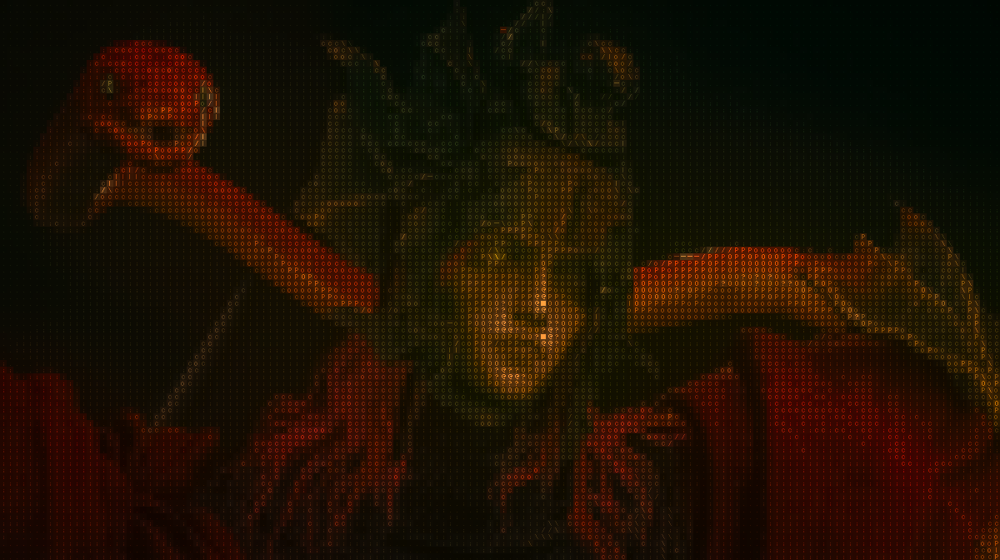
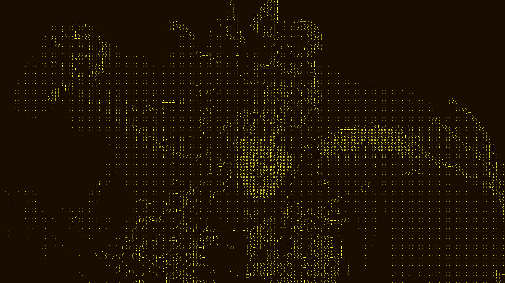
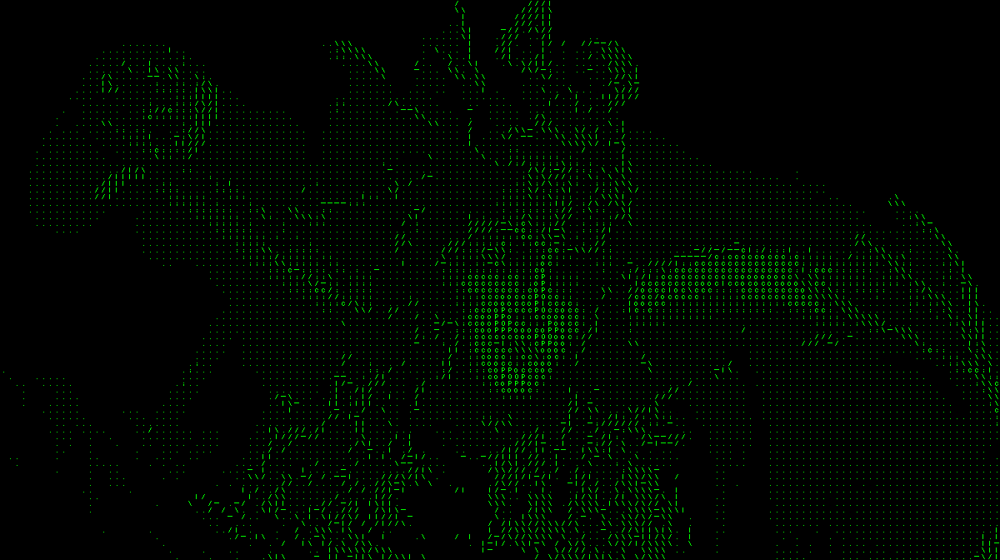

# High-Performance ASCII Rendering Engine

A fully GPU-accelerated, real-time ASCII rendering engine built with Python, PyTorch, and OpenCV. This project converts images, videos, and live webcam feeds into stylized ASCII art using advanced edge detection, directional classification, and dynamic color palettes.

Originally inspired by Garrett Gunnell's ([@Acerola_t](https://twitter.com/Acerola_t)) **[AcerolaFX](https://github.com/GarrettGunnell/AcerolaFX)** ASCII shader (`AcerolaFX_ASCII.fx`), this engine has been ported and optimized for Python, utilizing PyTorch to perform heavy matrix convolutions and vectorized tensor operations directly on the GPU, enabling high-framerate real-time processing.

## Features

* **Three Execution Modes:** Process live webcam feeds, static images, or pre-recorded videos through the exact same rendering pipeline.
* **GPU Acceleration:** Leverages PyTorch tensors and 2D convolutions to eliminate CPU bottlenecks.
* **Real-time Parameter Tuning:** An OpenCV control window allows live adjustment of exposure, edge thresholds, zoom, and blending.
* **Spatial Intensity Overdrive:** Artificially overdrives text luminance to compensate for the negative space inherent in terminal-based graphics, preventing "dull" outputs.
* **Custom Color Themes:** Includes mathematically defined palettes (Classic Green, Amber Retro, Gold/Green, White/Purple).

---

## 📸 Example Outputs

| Original Input | Full-Color ASCII | Amber CRT Theme | Classic Matrix Green |
|:---:|:---:|:---:|:---:|
|  |  |  |  |

---

## 🛠️ How It Works (The Rendering Pipeline)

Unlike naive ASCII converters that simply map pixel brightness to a character array, this engine analyzes structural features to draw coherent outlines and shapes.

1. **Difference of Gaussians (DoG):** The input frame is converted to grayscale and blurred twice using different kernel scales. Subtracting these blurs isolates high-frequency details (edges) while ignoring flat surfaces.
2. **Scharr Gradients:** A PyTorch 2D convolution applies Scharr operators to the edge map, calculating the X and Y gradient magnitudes.
3. **Directional Classification:** Using trigonometric masking, every pixel's gradient angle is classified into one of four directions: Vertical, Horizontal, Diagonal 1 (`/`), or Diagonal 2 (`\`).
4. **8x8 Tile Voting:** The image is divided into 8x8 blocks. The engine counts the directional classifications within each block and selects the dominant direction, effectively downsampling the edge map to match terminal character dimensions.
5. **LUT Font Mapping:** Depending on the dominant direction and localized luminance, the engine queries a master bitmap Lookup Table (LUT) to imprint the correct character (e.g., `-`, `|`, `/`, or density characters like `#`, `@`) onto the final tensor.

---

## 📦 Installation

### Prerequisites
* Python 3.10 or higher.
* An NVIDIA GPU is highly recommended for real-time webcam processing.

### 1. Clone the Repository
```bash
git clone [git@github.com:Devrao-2006/ASCIIStudio.git](git@github.com:Devrao-2006/ASCIIStudio.git)
cd app

```

### 2. Install Dependencies

Standard installation (defaults to CPU PyTorch in some environments):

```bash
pip install -r requirements.txt

```

**⚠️ Important Note for Windows/NVIDIA Users:**
To ensure the engine utilizes your GPU, you must install the CUDA-enabled version of PyTorch. Standard `pip install torch` often defaults to the CPU version. Run the following command to target CUDA 12.6 (adjust the index URL if you are using an older CUDA toolkit):

```bash
pip uninstall torch torchvision -y
pip install torch torchvision --index-url [https://download.pytorch.org/whl/cu126](https://download.pytorch.org/whl/cu126)

```

---

## 🚀 Usage

The project is unified under a single entry point: `main.py`.

### 1. Live Webcam Mode (Web UI)

Launches the **browser-based GPU control dashboard**. Opens automatically at `http://localhost:8000`.

```bash
python main.py webcam
```

Optional: specify a camera device index (default auto-detects):

```bash
python main.py webcam --device 1
```

> Press `Ctrl+C` in the terminal to stop the server.

### 2. Image Conversion

Converts a static image and saves the output to the disk.

```bash
python main.py image input.jpg output.png

```

### 3. Video Conversion

Processes a video frame-by-frame and compiles the result into a new MP4 file. Note: This process is computationally heavy and time to completion scales with the input video's resolution and framerate.

```bash
python main.py video input.mp4 output.mp4

```

---

## 🎛️ Controls & Parameters

All controls are live in the **browser sidebar** at `http://localhost:8000`. Changes are sent over WebSocket and take effect on the very next rendered frame.

### Camera
| Control | Range | Description |
|:---|:---|:---|
| **Zoom** | 1.0 – 5.0× | Affine zoom into the frame. Minimum locked at 1.0 to prevent border artifacts. |
| **Offset X / Y** | -1.0 – 1.0 | Pan the frame left/right and up/down. |

### Edge Detection
| Control | Range | Description |
|:---|:---|:---|
| **Kernel Size** | 1 – 10 | Gaussian blur half-kernel size. Larger = smoother edges. |
| **Sigma** | 0.1 – 5.0 | Primary Gaussian σ. |
| **Sigma Scale** | 0.1 – 5.0 | Ratio of secondary blur to primary (DoG spread). |
| **Tau** | 0.0 – 2.0 | Weight of secondary blur subtraction in DoG. |
| **Threshold** | 0.001 – 0.1 | Minimum DoG response before a pixel is counted as an edge. |
| **Edge Votes** | 0 – 64 | Minimum pixel votes in an 8×8 tile before an edge character is drawn. |

### Luminance
| Control | Range | Description |
|:---|:---|:---|
| **Exposure** | 0.1 – 5.0 | Brightness multiplier applied before character mapping. |
| **Attenuation** | 0.1 – 5.0 | Power-law exponent — brightens/darkens fill density selection. |
| **Color Blend** | 0.0 – 1.0 | Mixes original source color into the ASCII output (0 = monochrome). |
| **Intensity** | 0.5 – 5.0 | Overdrives the brightness of text pixels to make characters pop. |

### Toggles
| Toggle | Description |
|:---|:---|
| **Draw Edges** | Enable / disable edge ASCII characters. |
| **Draw Fill** | Enable / disable fill density characters. |
| **Invert ASCII** | Swap dark/light character density mapping. |

### View Mode
| Mode | Description |
|:---|:---|
| **Render** | Final full ASCII output (default). |
| **Edges** | DoG edge detection map only (debug). |
| **Gray** | Normalized grayscale input (debug). |

### Studio Modes (Top Navigation Bar)
| Studio Tab | Functionality |
|:---|:---|
| 📹 **Webcam** | Live webcam streaming with real-time GPU parameter tuning and instant recording (`R`). |
| 🖼️ **Convert Photo** | Drag & drop any image (`.png`, `.jpg`, `.webp`), preview live in your selected theme (**Amber**, **Classic Green**, **Gold**, etc.), adjust sliders reactively, and export high-res ASCII PNGs! |
| 🎬 **Convert Video** | Drag & drop video files (`.mp4`, `.mov`), select your desired theme and parameters, monitor rendering progress with a real-time progress bar, and download the exported MP4! |

### Theme Presets
Choose from 5 color palettes in the sidebar: **Classic** (Matrix Green), **Amber** (Retro CRT), **Gold** (Cyberpunk), **Ghost** (Purple-White), **Warm** (Sunset). All image and video exports inherit the active theme!

### Keyboard Shortcuts & Capture Tools
| Key / Button | Action |
|:---|:---|
| `R` / 🔴 Button | **Start / Stop Live Video Recording** (saves MP4 to `app/captures/videos/`) |
| `S` / 📷 Button | **Take Photo Snapshot** (downloads PNG to disk in active theme) |
| `F` / ⛶ Button | **Toggle Fullscreen Mode** (sidebar hidden, video fills monitor) |
| `Esc` | Exit fullscreen mode |
| Double-click video | Toggle fullscreen mode |


---

## 📁 Project Structure

```text
app/
├── main.py                    # CLI entry point
├── server.py                  # FastAPI web server (MJPEG + WebSocket)
├── requirements.txt           # Python dependencies
├── readme.md                  # This file
│
├── core/                      # Rendering engine
│   ├── ascii_engine.py        # Core GPU PyTorch rendering pipeline
│   ├── params.py              # ASCIIParams configuration dataclass
│   └── utils.py               # Shared helpers (progress bar, file checks)
│
├── cuda/                      # Custom C++/CUDA extension source
│   ├── tile_voting.cu         # Parallel CUDA kernel (8×8 tile voting)
│   └── tile_voting.cpp        # Pybind11 bindings + C++ CPU fallback
│
├── converters/                # Batch processing modes
│   ├── image_converter.py     # Static image → ASCII render
│   └── video_converter.py     # Video file → ASCII video
│
├── static/                    # Web UI frontend (served by FastAPI)
│   ├── index.html             # App layout and controls markup
│   ├── style.css              # Dark glassmorphic theme
│   └── main.js                # WebSocket, sliders, fullscreen logic
│
├── assets/                    # Bitmap LUT textures
│   ├── edgesASCII.png         # Edge direction character bitmaps
│   └── fillASCII.png          # Fill density character bitmaps
│
├── tests/                     # Verification scripts
│   └── test_cuda_extension.py # CUDA kernel correctness + benchmark
│
├── legacy/                    # Superseded OpenCV desktop UI (reference)
│   ├── webcam.py              # Original OpenCV capture loop
│   └── ui.py                  # Original OpenCV trackbar controls
│
├── doc/                       # Developer documentation
│   ├── dev.readme.md          # Full project architecture reference
│   └── ui_design.md           # Web UI design system + parameter docs
│
└── captures/                  # Saved screenshot/snapshot outputs
```

---

## Acknowledgements & Inspiration

* **[AcerolaFX](https://github.com/GarrettGunnell/AcerolaFX)** by Garrett Gunnell ([@Acerola_t](https://github.com/GarrettGunnell)): The original mathematical algorithm, Difference of Gaussians edge detection, directional classification, and ASCII LUT mapping technique are based on Acerola's open-source HLSL post-processing shaders (`AcerolaFX_ASCII.fx`) and educational breakdown on ASCII rendering pipelines.